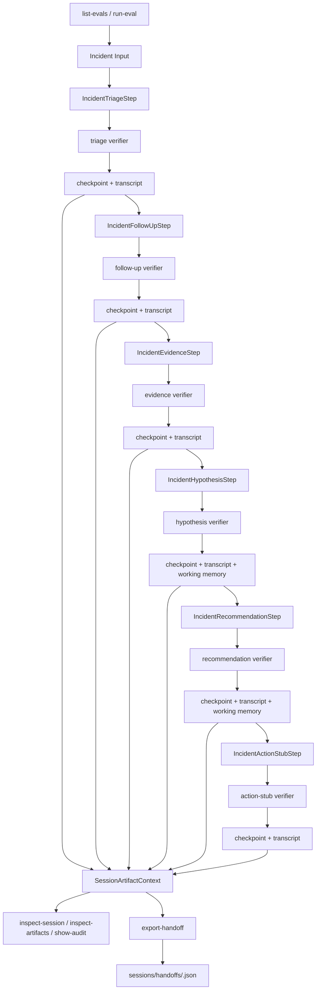

# Architecture Summary

## Purpose

This repository is a production-oriented incident-response runtime prototype. It is designed to
show how an agent harness can be made verifier-driven, resumable, auditable, and approval-aware
before adding broader automation. The current milestone now includes one narrow live execution path
for the `deployment-regression` family on a local demo target.

The design borrows mature harness ideas from systems like Claude Code, but it is not a coding
agent clone. It is an incident-response runtime with narrow, typed, deterministic slices.

For the operator command sequence on top of this architecture, see [Usage Guide](usage.md) and
[Demo Guide](demo.md).

## Runtime Lifecycle

The implemented runtime is an explicit incident chain, not a generic workflow engine:

`triage -> follow-up -> evidence -> hypothesis -> recommendation -> approval-gated action stub`

For live approved deployment-regression sessions, the chain continues through:

`bounded rollback execution -> outcome verification`

Triage is intentionally bespoke. It establishes the first transcript and checkpoint records from a
structured incident payload. The downstream slices are resumable continuations built on the shared
harness and recovered artifact chain.



## Runtime Spine

Implemented chain:

- replay / pre-approval:
  `triage -> follow-up -> evidence -> hypothesis -> recommendation -> approval-gated action stub`
- live approved deployment-regression:
  `triage -> follow-up -> evidence -> hypothesis -> recommendation -> approval-gated action stub -> bounded rollback execution -> outcome verification`

Each slice:

1. consumes one prior durable artifact
2. emits structured transcript events
3. runs one verifier
4. writes the next checkpointed phase

The replay path stops at an approval-gated action stub on purpose. The live path only continues for
one bounded rollback slice after approval is durably recorded.

## Narrow Chain, Not Generic Orchestration

The runtime surface is intentionally split:

- execution surface:
  the explicit incident chain in `src/agent/incident_*.py`
- live deployment-regression surface:
  `src/runtime/live_surface.py` plus `src/runtime/demo_target.py`
- inspection and export surface:
  `src/runtime/cli.py` plus `src/runtime/inspect.py`
- replay and demo surface:
  `src/runtime/eval_surface.py` plus `src/evals/incident_chain_replay.py`

There is no generic operator command for arbitrary session creation or loop orchestration. That is
intentional. The current runtime is a narrow incident-response harness with one well-defined chain
plus one explicit live deployment-regression command flow.

## Four Runtime Layers

### 1. Control Plane

Control state lives in checkpoints:

- `current_phase`
- `current_step`
- `pending_verifier`
- `approval_state`
- `summary_of_progress`

Checkpoint state answers: where is the harness, what is it waiting on, and what is the latest
compact progress marker?

Checkpoint is not the place for semantic incident understanding or transcript history.

### 2. Execution Truth

Execution truth lives in append-only transcript events plus verifier-backed artifacts reconstructed
from them.

Transcript event types currently include:

- `resume_started`
- `model_step`
- `permission_decision`
- `tool_request`
- `tool_result`
- `verifier_result`
- `checkpoint_written`

This layer answers: what actually happened, in what order, and which outputs were verifier-backed?

### 3. Semantic Incident Memory

`IncidentWorkingMemory` is the first semantic-memory slice.

It stores a compact verified snapshot of current incident understanding, such as:

- leading hypothesis summary
- unresolved gaps
- important evidence references
- recommendation summary
- compact handoff note

It is written only on verifier-passed `incident_hypothesis` and `incident_recommendation`
transitions. It does not replace checkpoints or transcripts.

### 4. Operator-Facing Derived Artifacts

Operator-facing handoff output is a derived layer, not runtime truth.

Current derived artifacts:

- `IncidentHandoffContext`
- stable handoff artifact JSON under `sessions/handoffs/<incident_id>.json`

These are built for readability and handoff, not for resume or verifier control.

## Checkpoint, Transcript, And SessionArtifactContext

The core runtime relationship is:

- checkpoint defines control state
- transcript preserves append-only execution history
- `SessionArtifactContext` reconstructs the latest usable durable artifacts from both

`SessionArtifactContext` centralizes:

- latest artifact lookup for triage, follow-up, evidence, hypothesis, recommendation, and action
  stub outputs
- verifier-aware usability checks
- typed insufficiency reasons
- typed synthetic failures when a prior artifact chain is malformed, partial, or inconsistent

That removes repeated step-local reconstruction while preserving checkpoint plus transcript as the
source of truth.

This is the main durable-state seam for the current repository. The inspection CLI, handoff
regeneration path, and replay summaries all sit on top of `SessionArtifactContext` instead of
inventing a second artifact loader.

## Synthetic Failure Invariants

This runtime distinguishes between ordinary insufficiency and structured failure.

### Insufficiency

Insufficiency means the chain is conservatively not ready to proceed yet.

Examples:

- checkpoint phase is incompatible with a later slice
- a required prior verifier has not passed

### Synthetic Failure

Synthetic failure means the chain expected a durable artifact but found an invalid runtime path.

Examples:

- malformed tool output
- invalid verifier output
- missing verifier result where one should exist
- interrupted step with a `tool_request` but no `tool_result`
- missing required artifact for a checkpointed phase

Failures are normalized into structured `tool_result` or `verifier_result` artifacts so they stay
replayable and auditable.

## Shared Resumable-Slice Harness

The downstream slices share a thin harness that centralizes:

- context loading
- `resume_started` emission
- `model_step` emission
- permission-checked read-only tool execution
- synthetic failure normalization
- verifier execution
- checkpoint writing

It does not absorb domain reasoning. Steps still own:

- which prior artifact they require
- which branch they take
- how outputs are interpreted
- how phases and summaries are shaped

This keeps the runtime explicit while reducing duplicated wiring.

The asymmetry matters:

- `IncidentTriageStep` is the special-case entrypoint that establishes the first durable records
- `IncidentFollowUpStep` through `IncidentActionStubStep` are resumable slices that reload prior
  durable state before proceeding

That shape is reflected in the current replay runner and should be read as part of the runtime’s
intentional narrowness.

## Permission Provenance And Approval Boundaries

Permission decisions are structured runtime artifacts, not just booleans.

Current permission provenance records:

- policy source
- action category
- evaluated action type
- approval requirement
- approval reason
- conservative or denial reason
- safety boundary
- future preconditions

That improves replayability and makes approval logic inspectable.

The runtime’s safety boundary is explicit:

- read-only steps may proceed under default-safe policy
- stronger evidence can justify an action candidate
- action candidacy is still not execution
- future non-read-only work remains blocked pending explicit approval design

That is why the general runtime still ends at an approval-gated action stub and only the live
deployment-regression path moves into one explicitly bounded rollback.

The action stub is therefore a verified and durable boundary marker, not a hidden placeholder for
future autonomous execution.

## Incident Working Memory

`IncidentWorkingMemory` exists to separate semantic understanding from control state.

It is:

- mutable latest snapshot
- verifier-backed
- local JSON
- incident-scoped

It is not:

- transcript history
- checkpoint control state
- project memory
- a source of truth for resume

`SessionArtifactContext` exposes it read-only so later assembly layers can use it as a supplement.

## Handoff Context, Artifact Writing, And Regeneration

The operator-facing handoff path is deliberately layered:

`SessionArtifactContext -> IncidentHandoffContextAssembler -> IncidentHandoffArtifactWriter`

### Handoff Context Assembly

The assembler combines:

- checkpoint control state
- verifier-backed artifacts from `SessionArtifactContext`
- `IncidentWorkingMemory` when it is current and helpful

Precedence is explicit:

- checkpoint wins for control state
- verified artifacts win for execution truth
- working memory supplements semantic summaries

### Stable Handoff Artifact

The writer produces one deterministic JSON artifact per incident:

- `sessions/handoffs/<incident_id>.json`

It overwrites the latest handoff snapshot for that incident using stable ordering and a fixed file
name rule.

### Regeneration Seam

The repo also includes a narrow internal regeneration seam:

```python
from context.handoff_regeneration import IncidentHandoffArtifactRegenerator

result = IncidentHandoffArtifactRegenerator().regenerate("session-id")
```

That seam:

- loads durable session state
- rebuilds `SessionArtifactContext`
- assembles `IncidentHandoffContext`
- rewrites the stable handoff artifact

If the current durable state is insufficient or inconsistent, regeneration returns a structured
`written` / `insufficient` / `failed` result instead of fabricating a handoff summary.

## Replay / Eval Coverage

The repository includes replay-style coverage for two deterministic branches:

- supported:
  `recent_deployment -> deployment_regression -> validate_recent_deployment -> rollback_recent_deployment_candidate`
- conservative:
  `runbook -> insufficient_evidence -> investigate_more -> no_actionable_stub_yet`

The operator-facing replay surface is:

- `oncall-agent list-evals`
- `oncall-agent run-eval <scenario>`

`run-eval` executes the real chain over fixed fixtures, preserves the resulting artifact directory,
and summarizes the replay via `SessionArtifactContext` plus the handoff regenerator. This makes the
eval layer a demo and audit surface for the existing runtime rather than a separate benchmark
framework.

This is intentionally narrow. It proves the runtime spine, not broad benchmark coverage.

## Why The Runtime Stops Here

This milestone is meant to be runtime-complete for the current scope, not product-complete.

What is complete:

- verifier-gated slice chain
- checkpoint plus transcript resumability
- artifact reconstruction through `SessionArtifactContext`
- synthetic failure normalization
- shared slice harness
- permission provenance
- first incident-working-memory slice
- operator-facing handoff assembly, writing, and regeneration

What is intentionally deferred:

- broad execution semantics beyond the one bounded rollback demo
- project-memory promotion
- approval UI or reviewer workflow
- external integrations
- generic planner or broader workflow engine

That stopping point is deliberate. The repository now demonstrates a coherent, interview-ready
runtime architecture without overclaiming autonomy or breadth.
